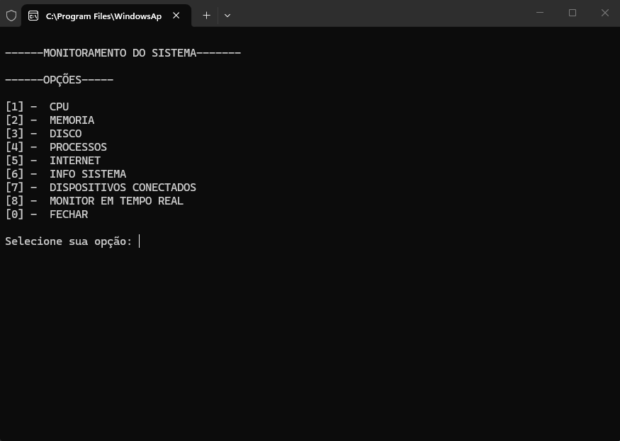
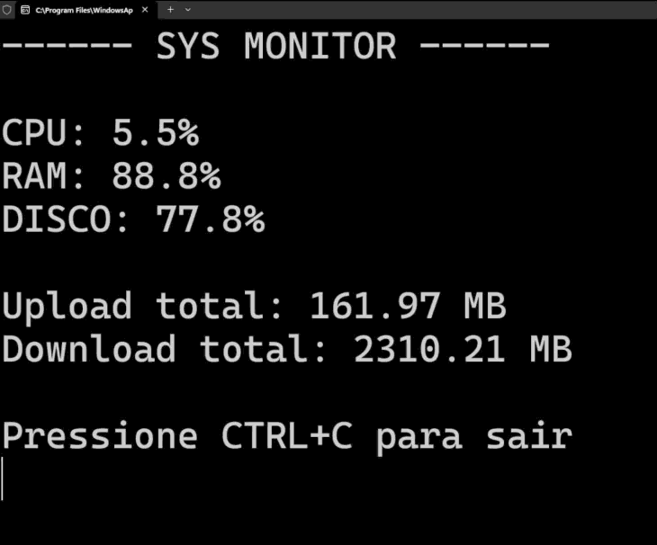
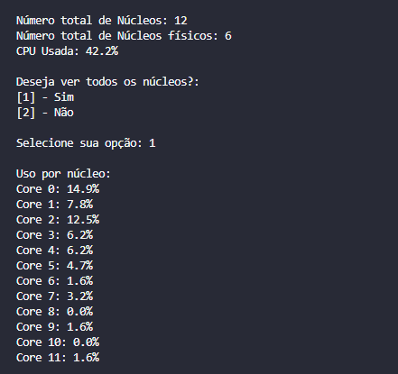
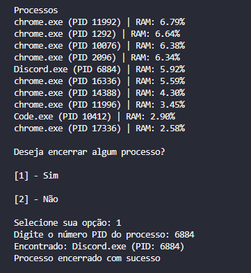
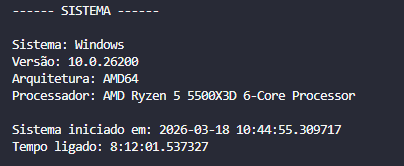
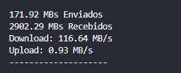
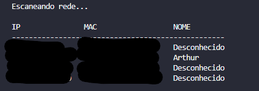

# SysMonitor

> Um monitor de sistema simples em Python para Windows, mostrando uso de CPU, memória, disco, processos, rede e informações do sistema.

---

## 📌 Visão geral

O **SysMonitor** é um utilitário de linha de comando que reúne várias funções de monitoramento de sistema (CPU, RAM, disco, processos, rede, informações do sistema e monitoramento em tempo real) em um menu interativo.

O projeto é pensado para ser fácil de estender: cada recurso está em um módulo separado (`sysmonitor/`), facilitando manutenção e reutilização.

---

## 🚀 Recursos

- ✔️ Informações de CPU (uso total + por núcleo)
- ✔️ Informação de memória (uso + alerta de consumo alto)
- ✔️ Espaço em disco por partição
- ✔️ Exibição dos processos com maior uso de memória + opção de encerrar um processo
- ✔️ Informações de rede (upload/download)
- ✔️ Scanner de dispositivos na rede local (ARP)
- ✔️ Informações de sistema (OS, versão, uptime, CPU)
- ✔️ Monitoramento em tempo real (tela atualiza a cada segundo)

---

## ⚙️ Instalação

### 1) Clonar o repositório

```bash
git clone https://github.com/tox1cfps/SysMonitor.git
cd SysMonitor
```

### 2) Criar e ativar um ambiente virtual (recomendado)

Windows (PowerShell):

```powershell
python -m venv .venv
.\.venv\Scripts\Activate.ps1
```

### 3) Instalar dependências

```powershell
python -m pip install -r requirements.txt
```

> ⚠️ Se ainda não existir um `requirements.txt`, basta instalar `psutil`, `scapy` e `wmi` manualmente:
>
> ```powershell
> python -m pip install psutil scapy wmi
> ```

---

## ▶️ Uso

Execute o script principal:

```powershell
python main.py
```

Siga o menu para acessar cada funcionalidade.

---

## 🧠 Estrutura do projeto

- `main.py` – entrada principal (chama o menu)
- `sysmonitor/` – pacotes com cada funcionalidade separada
  - `ui.py` – menu e roteamento de opções
  - `cpu.py`, `memory.py`, `disk.py`, `processes.py`, `network.py`, `realtime.py`, `system_info.py`

---

## 🖼️ Capturas / imagens

### Tela principal


### Monitor em tempo real


### Monitor de CPU


### Monitor de Memória


### Monitor de Disco


### Monitor de Processos


### Monitor de Sistema


### Monitor de Internet


### Usuários conectados na Rede


## 📝 Personalização

- Ajuste o intervalo e os limites de alerta no código (ex.: CPU > 90%, memória > 60%).
- Modifique o scanner de rede (`sysmonitor/network.py`) para usar outra faixa de endereços.

---

## 🚩 Licença

Este projeto está disponível sob a licença **MIT**.
